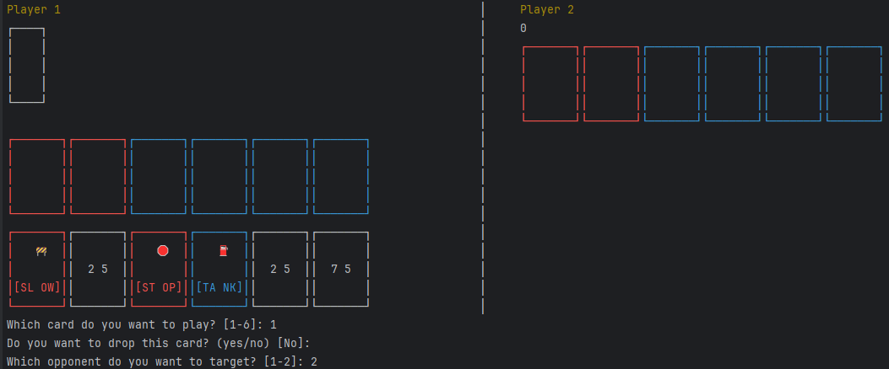
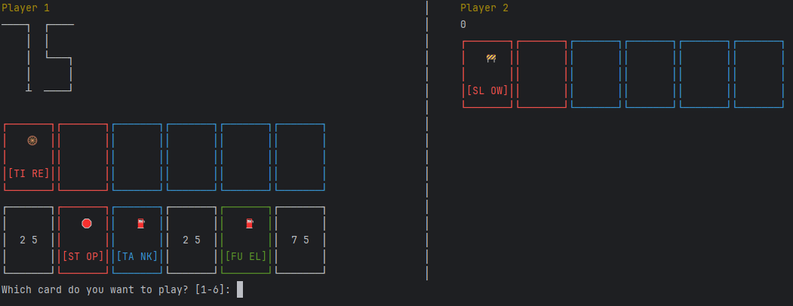

# Mille Bornes

## Description
Mille Borne is a card game that simulates a road trip. Players take turns drawing cards and playing them to move their car forward, while also trying to stop their opponents from moving. The goal is to be the first player to reach 1000 miles.

## Features
- Two or Three players
- Card deck with various types of cards

## Requirements
- Work on Linux System
- don't work on Windows, but can be run on WSL
- didn't test on MacOS

## Installation
- Clone the repository:
- Build the project:
```bash
cmake -B build
```
- Compile the project:
```bash
cmake --build build
```
- Run the project:
```bash
./build/MilleBornes
```

## Usage
- To start a new game, run the program and follow the prompts.
- To play a card, select the card you want to play from your hand and follow the instructions on the card.

## Preview

Preview of the game interface:



