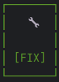

# Mille Bornes

## Description

Mille Borne is a card game that simulates a road trip. Players take turns drawing cards and playing them to move their
car forward, while also trying to stop their opponents from moving. The goal is to be the first player to reach 1000
miles.

## Features

- Two or Three players
- Card deck with various types of cards

### Cards Type

| Type     | Description                                                                         |
|----------|-------------------------------------------------------------------------------------|
| Distance | Increase your score                                                                 |
| Hazard   | Stop your opponent                                                                  |
| Remedy   | Remove a hazard                                                                     |
| Safety   | Protect yourself by removing current applied hazard and preventing from receive one |

| Hazard      | Card                                     |
|-------------|------------------------------------------|
| Accident    |    |
| Out of Gas  |    |
| Flat Tire   |    |
| Stop Sign   |        |
| Speed Limit |  |

| Remedy             | Card                                          |
|--------------------|-----------------------------------------------|
| Repair             |           |
| Gasoline           |         |
| Spare Tire         |        |
| Go                 |               |
| End of Speed Limit |  |

| Safety            | Card |
|-------------------|------|
| Driving Ace      |  |
| Extra Tank     |    |
| Puncture Proof   |  |
| Right of Way     |    |

## Requirements!

- Work on Linux System (build-essential libssl-dev cmake)
- don't work on Windows, but can run on WSL
- didn't test on MacOS

## Installation

- Clone the repository:
- Build the project:

```bash
cmake -B build
```

- Compile the project:

```bash
cmake --build build
```

- Run the project:

```bash
./build/MilleBornes
```

## Usage

- To start a new game, run the program and follow the prompts.
- To play a card, select the card you want to play from your hand and follow the instructions on the card.

## Preview

Preview of the game interface:


## Credit

- [Mille Bornes](https://en.wikipedia.org/wiki/Mille_Bornes) - Wikipedia